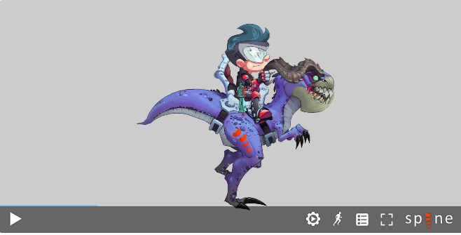

# Spine Web Demo

This repository is going to demo some animations using [Spine API](http://esotericsoftware.com/spine-api-reference). The simple demo is credited to [Spine](http://zh.esotericsoftware.com).

---
## Description

The Spine Web Player uses [WebGL](https://developer.mozilla.org/en-US/docs/Web/API/WebGL_API) for rendering. While WebGL is supported by all recent versions of popular desktop and mobile browsers, there may be compatibility issues with old browsers.

### Exporting files for the Spine Web Player

The Spine Web Player requires the following files for displaying whole animation:

* `*.json` - display Spine skeltons
* `*.atlas` and more `*.png` - display texture atlas

These files must be uploaded to a web server and accessible via URLs.

* The `*.png` files need to be accessible under the same path as the `*.altas` file.
* If you changed the name of the `*.png` file, you also need to change it in the `*.altas`.

---
## Usage

> **NOTICE**: Make sure you have already installed [Node.js](https://nodejs.org/en/) on your machine

1. Clone this repository to your machine
2. Open this repository and install some necessary modules for Node
    ```bash
    # Make sure your current directory is correct
    $ npm install
    ```
3. Run the demo page via Node server
    ```bash
    # Make your current directory is correct
    $ npm start
    ## If succeed, you will get the following message:
    > spine-demo@1.0.0 start D:\SpinePlayer-Demo
    > node app.js

    Server running at http://127.0.0.1:3000/
    ```
4. Open your browser with `http://127.0.0.1:3000` and you will get the result as follow
    

### Spine Assets

The demo assets is in the folder `assets/spine/`, you can also add your own Spine assets.

---
## Contributor

> **NOTICE:** You can follow the contributing process [CONTRIBUTING.md](CONTRIBUTING.md) to join me. I am very welcome any issue!

* [David Lu](https://github.com/yungshenglu)

---
## License

[GNU GENERAL PUBLIC LICENSE Version 3](LICENSE)